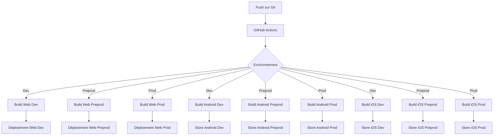

# Documentation de l'Architecture Flutter Starter Kit

## Table des matières
1. [Structure du Projet](#structure-du-projet)
2. [Architecture en Couches](#architecture-en-couches)
3. [Guide de Développement](#guide-de-développement)
4. [CI/CD et Déploiement](#cicd-et-déploiement)

## Structure du Projet

```
predixball/
├── lib/
│   ├── core/           # Fonctionnalités de base et utilitaires
│   ├── data/           # Couche d'accès aux données
│   ├── domain/         # Logique métier et modèles
│   ├── ui/             # Interface utilisateur
│   └── injection.dart  # Configuration de l'injection de dépendances
├── test/              # Tests unitaires et d'intégration
├── mocks/             # Mocks pour les tests
└── [plateformes]      # Configurations spécifiques aux plateformes
    ├── android/
    ├── ios/
    ├── web/
    ├── windows/
    ├── linux/
    └── macos/
```

## Architecture en Couches

### 1. Couche Core (`lib/core/`)
- **Configuration** : Paramètres globaux de l'application
- **Constants** : Constantes et énumérations
- **Errors** : Gestion des erreurs
- **Network** : Configuration réseau
- **Utils** : Utilitaires et helpers

### 2. Couche Data (`lib/data/`)
- **Datasources** : Sources de données (API, base de données locale)
- **Models** : Modèles de données
- **Repositories** : Implémentation des repositories

### 3. Couche Domain (`lib/domain/`)
- **Entities** : Entités métier
- **Repositories** : Interfaces des repositories
- **UseCases** : Cas d'utilisation
- **Blocs** : Logique de gestion d'état

### 4. Couche UI (`lib/ui/`)
- **Screens** : Écrans de l'application
- **Widgets** : Composants réutilisables
- **Theme** : Thème et styles
- **Routes** : Gestion de la navigation

## Guide de Développement

### Création d'une Nouvelle Feature

1. **Définir l'Entité**
   ```dart
   // lib/domain/entities/ma_feature.dart
   class MaFeature {
     final String id;
     final String name;
     // ...
   }
   ```

2. **Créer le Repository Interface**
   ```dart
   // lib/domain/repositories/ma_feature_repository.dart
   abstract class IMaFeatureRepository {
     Future<List<MaFeature>> getFeatures();
     // ...
   }
   ```

3. **Implémenter le Repository**
   ```dart
   // lib/data/repositories/ma_feature_repository_impl.dart
   class MaFeatureRepositoryImpl implements IMaFeatureRepository {
     // ...
   }
   ```

4. **Créer le Bloc**
   ```dart
   // lib/domain/blocs/ma_feature_bloc.dart
   class MaFeatureBloc extends Bloc<MaFeatureEvent, MaFeatureState> {
     // ...
   }
   ```

5. **Développer l'UI**
   ```dart
   // lib/ui/screens/ma_feature_screen.dart
   class MaFeatureScreen extends StatelessWidget {
     // ...
   }
   ```

### Création d'un Widget Commun

1. Créer le widget dans `lib/ui/widgets/`
2. Documenter les props et l'utilisation
3. Ajouter des tests unitaires
4. Exporter dans `lib/ui/widgets/index.dart`

## CI/CD et Déploiement

### Schéma d'Architecture CI/CD



### Workflow de Déploiement

1. **Développement**
   - Build automatique sur push vers `develop`
   - Déploiement sur environnement de dev
   - Tests automatiques

2. **Préproduction**
   - Build sur merge vers `preprod`
   - Déploiement sur environnement de preprod
   - Tests de validation

3. **Production**
   - Build sur merge vers `main`
   - Déploiement sur environnement de prod
   - Publication sur les stores

### Configuration des Flavors

Le projet utilise différents fichiers `main_*.dart` pour gérer les environnements :
- `main_dev.dart` : Développement
- `main_integration.dart` : Intégration
- `main_recette.dart` : Recette
- `main_preprod.dart` : Préproduction
- `main_prod.dart` : Production

Chaque flavor a sa propre configuration dans `flavorizr.yaml` pour gérer les variables d'environnement et les ressources spécifiques. 